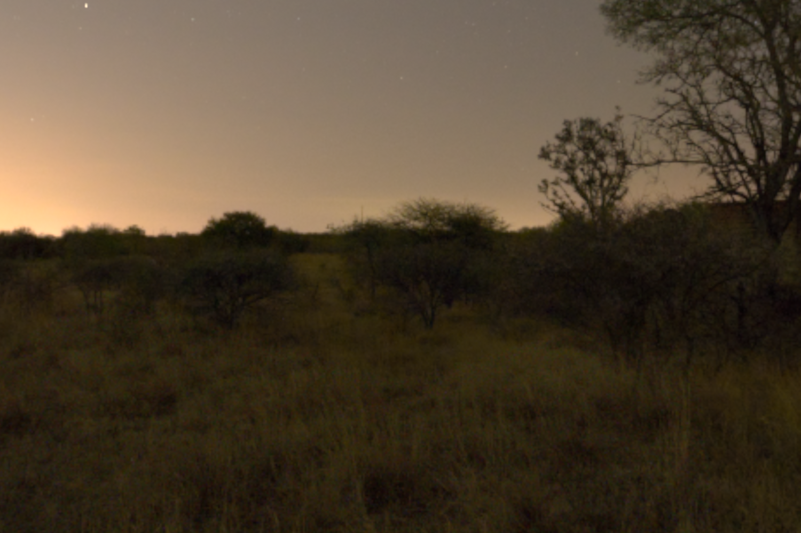

# Mitsuba-Sensors
 A collection of different Mitsuba3 sensor plugins.

# Installation

1. Clone the repository.
2. Install the environment.

```bash
conda env create -f environment.yml
```

3. Activate the environment.
```bash
conda activate mitsuba-sensors
```

4. Do a test rendering with the model.
```bash
python spherical_sensor.py
```

## Models:
1. pinhole_model.py
* No Distortion is assumed.
* Only focal length and principal point is modeled.



2. sphereical_model.py
* A spherical model
* Credit to [Delio Vicini](https://dvicini.github.io/).
* Please see [here](https://github.com/rgl-epfl/differentiable-sdf-rendering/blob/main/figures/spherical_sensor.py) for the orignal code.


# EXR
[This](https://polyhaven.com/a/dikhololo_night) is the EXR file used in the example scene.

# See also
[Scripting a renderer](https://mitsuba.readthedocs.io/en/stable/src/rendering/scripting_renderer.html)

Thanks to [Delio Vicini](https://dvicini.github.io/) for the inspiration and the template that I adapted.
https://github.com/rgl-epfl/differentiable-sdf-rendering/blob/main/figures/spherical_sensor.py
